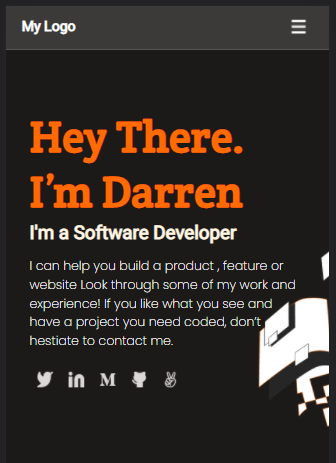

# Portoflio

## Screenshot

# Additional description about the project and its features.

Microverse project for the development of a Software Engineer Portfolio

## Built With

- HTML, CSS
- .Stylelintrc
- .Hintrc

## Getting Started

To get a local copy up and running follow these simple example steps.

### Prerequisites

You would need a code editor such as vs code for this project

## Authors

👤 **Author1**

- GitHub: [@githubhandle](https://github.com/darrenodi)
- Twitter: [@twitterhandle](https://twitter.com/darrenodi)
- LinkedIn: [LinkedIn](https://www.linkedin.com/in/darren-odi-404ba31b2/)

## 🤝 Contributing

Contributions, issues, and feature requests are welcome!

## Show your support

Give a ⭐️ if you like this project!

## Acknowledgments

- Hat tip to anyone whose code was used
- Inspiration
- etc

## 📝 License

This project is [MIT](./MIT.md) licensed..
